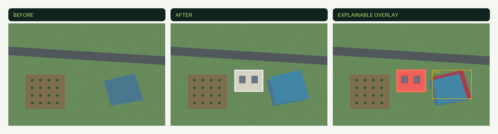
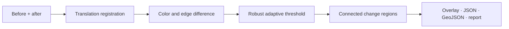

# GeoChange Lab

**Explainable geospatial change detection from paired satellite or aerial images.**

[](https://github.com/g14140596-creator/geochange-lab/actions/workflows/ci.yml)
[](https://www.python.org/)
[](LICENSE)

GeoChange Lab compares two images of the same place, corrects small alignment errors,
detects coherent changes, and exports evidence that a human can inspect. It is designed
as a transparent alternative to a black-box “changed / unchanged” prediction.



## Why this project

Award-winning student projects increasingly combine a specific real-world problem,
technical depth, accessible interaction, and evidence users can validate. GeoChange Lab
applies that pattern to Earth observation while staying honest about uncertainty.

Design inspiration came from three recent, official examples: the 2026 Imagine Cup
champion [CopyFlag](https://imaginecup.microsoft.com/en-us/Home/Registered) pairs vision
technology with a precise creator problem; NASA Space Apps evaluates projects on science,
data, technology, impact, and storytelling; and the 2025 Regeneron STS top project turned
an enormous astronomy dataset into a verifiable classification workflow. GeoChange Lab
extends those principles into a smaller, reproducible MVP rather than copying any project.

This repository demonstrates:

- computer vision fundamentals implemented from scratch;
- robust statistics and connected-component analysis;
- geospatial export and human-readable reporting;
- a Python package, CLI, REST API, web UI, Docker image, tests, and CI;
- product thinking through explicit users, limitations, and validation criteria.

## What it produces

| Output | Purpose |
|---|---|
| `overlay.png` | Highlights and ranks regions for visual review |
| `mask.png` | Machine-readable binary change mask |
| `result.json` | Alignment, threshold, region and quality metrics |
| `changes.geojson` | Regions importable into GIS workflows |
| `report.md` | Plain-language evidence and limitations |

## Quick start

```bash
git clone https://github.com/g14140596-creator/geochange-lab.git
cd geochange-lab
python -m venv .venv
source .venv/bin/activate  # Windows: .venv\Scripts\activate
pip install -e .

geochange analyze examples/before.png examples/after.png --output geochange-output
```

Run the optional API and web interface:

```bash
pip install -e ".[api]"
uvicorn geochangelab.api:app --reload
# Open http://127.0.0.1:8000
```

Or use Docker:

```bash
docker build -t geochange-lab .
docker run --rm -p 8000:8000 geochange-lab
```

## Algorithm pipeline



The score combines RGB appearance change with edge-structure change. A median/MAD
threshold adapts to each image pair. Every final region keeps its area, bounding box,
centroid, mean score, maximum score, and severity. See [algorithm notes](docs/algorithm.md)
and [architecture](docs/architecture.md).

## Example result

The deterministic demo contains a new building and a changed water boundary. It can be
regenerated with:

```bash
python scripts/generate_demo.py
```

Generated artifacts live in [`examples/`](examples/). The sample is synthetic by design,
so the repository is reproducible and free of imagery licensing ambiguity.

## Testing

```bash
python -m unittest discover -s tests -v
```

Tests cover translation recovery, no-change behavior, material-region detection,
geospatial projection, and report limitations. GitHub Actions reruns the suite and demo
generation on every push and pull request.

## Responsible use

GeoChange Lab is a screening and learning tool, not an authoritative land-use,
environmental, insurance, or emergency decision system. Clouds, shadows, seasonal
vegetation, different sensors, and geometric distortion can all create false positives.
Always review original imagery and metadata.

## Evidence and inspiration

- [Microsoft Imagine Cup 2026 winner and finalists](https://imaginecup.microsoft.com/en-us/Home/Registered)
- [NASA Space Apps judging and award categories](https://www.spaceappschallenge.org/resources/judging-awards-guide/)
- [Regeneron Science Talent Search 2025 top awards](https://www.societyforscience.org/press-release/regeneron-sts-top-awards-2025/)

## Roadmap

- [ ] GeoTIFF metadata and multispectral band adapters
- [ ] Sentinel-2 cloud masks and radiometric normalization
- [ ] 30-pair labeled benchmark with region precision/recall
- [ ] Interactive map overlay and human review annotations
- [ ] Optional learned encoder with side-by-side baseline comparison

## Author

Built by **Grace Huang**, a computer science undergraduate interested in AI product
management, software engineering, computer vision, and practical open-source tools.
