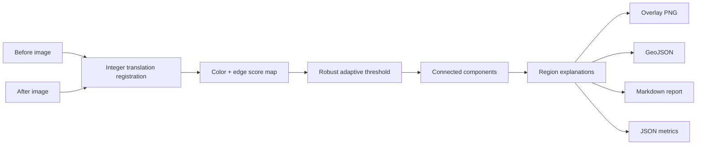

# Architecture

The project is intentionally modular: image registration, scoring, segmentation,
geospatial export, reporting, CLI, and API are separate layers. The core library has
only two runtime dependencies (`numpy` and `Pillow`), which keeps the algorithm easy
to inspect and deploy.

## Design decisions

- **Auditable over opaque:** every highlighted area can be traced to a score,
  threshold, connected component, and bounding box.
- **Local-first:** uploaded images are processed in memory; no cloud model is required.
- **Graceful scope:** integer registration handles small offsets but does not claim to
  solve rotation, perspective, or cross-sensor radiometric normalization.
- **Useful outputs:** GeoJSON and Markdown make the result portable to GIS and review
  workflows, not just a one-off visualization.

